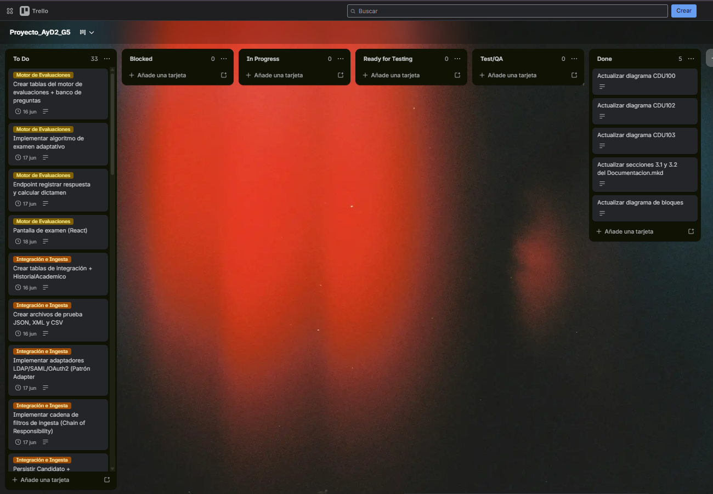
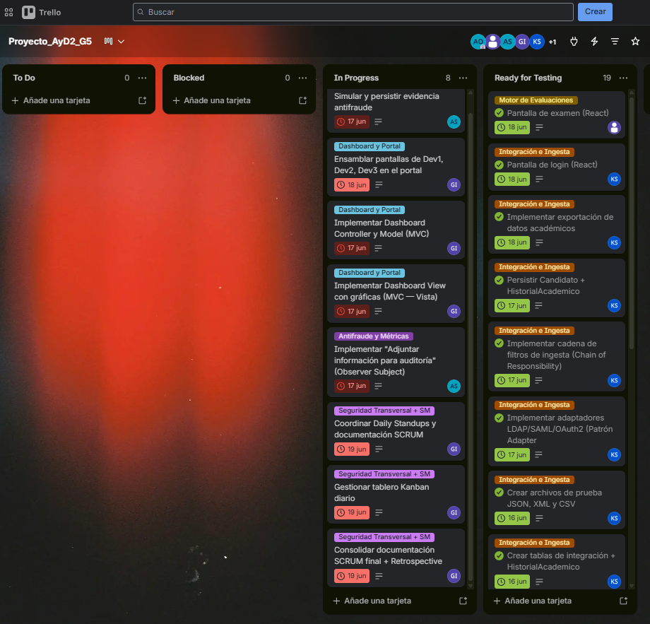
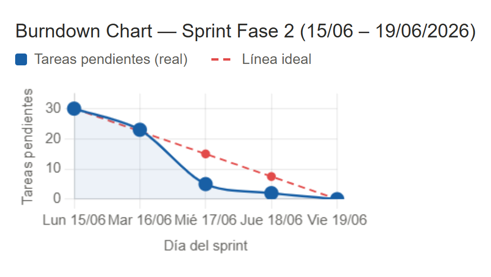

# Bitácora de Trabajo Arquitectónico — Fase 2 (Sprint MVP)

**Proyecto:** Plataforma Regional de Certificación de Competencias Digitales (PRCCD)

**Grupo:** 5 — AYD2 Sección P

**Sprint:** Único (lunes 15/06 — viernes 19/06/2026)

**Scrum Master:** Aída Alejandra Mansilla Orantes (202100239)

---

## 1. Sprint Planning y Gestión del Backlog

### 1.1 Objetivo del Sprint

Materializar en código funcional los 5 flujos críticos definidos en el DDA de la Fase 1:
ingesta de datos universitarios, motor de examen adaptativo, módulo antifraude, emisión
de certificado inmutable y dashboard analítico con métricas anonimizadas.

### 1.2 Sprint Backlog

#### 1.2.1 Correcciones de Fase 1 (realizadas previo al inicio del Sprint — estado: Done)

| ID | Responsable | Tarea | Feedback recibido (Fase 1) | Estado |
|----|---|---|---|---|
| T0.1 | Kevin (202101007) | Actualizar diagrama CDU100 | CDU100: la detección de fraude no corresponde a este flujo | Done |
| T0.2 | Kevin (202101007) | Actualizar diagrama CDU102 | CDU102: faltaba paso explícito de validación de tipo de archivo | Done |
| T0.3 | Kevin (202101007) | Actualizar diagrama CDU103 | CDU103: nombre redundante, indicación del auxiliar | Done |
| T0.4 | Alejandra (202100239) | Actualizar secciones 3.1 y 3.2 de Docs/Documentacion.mkd | Congruencia interna del documento | Done |
| T0.5 | Alejandra (202100239) | Expandir RF de 6 a 25 y actualizar matrices | Feedback: los RF deben corresponder a cada caso de uso | Done |
| T0.6 | Nufio (201901444) | Actualizar diagrama de bloques | Feedback: el diagrama de bloques debe ser más abstracto | Done |
| T0.7 | Alejandra (202100239) | Actualizar RF, EaC y Restricciones con estructura del metodo de diseno centrado en arquitectura | Feedback: los drivers deben derivarse de los CDU y seguir la estructura formal | Done |
| T0.8 | Alejandra (202100239) | Agregar tabla de descripcion textual por cada elipse de CDU100 al CDU104 (25 tablas) | Feedback: debe haber una tabla de descripcion textual por cada elipse, no una por CDU | Done |

#### 1.2.2 Sprint Backlog — Desarrollo del MVP

| ID | Responsable | Tarea | Driver | Patrón |
|----|---|---|---|---|
| T1 | Lizz (201708997) | Crear tablas motor de evaluaciones + banco de preguntas | RF01 | — |
| T2 | Lizz (201708997) | Implementar algoritmo de examen adaptativo | RF01, RF02 | — |
| T3 | Lizz (201708997) | Endpoint registrar respuesta y calcular dictamen | RF04 | — |
| T4 | Lizz (201708997) | Pantalla de examen (frontend) | CDU100 | — |
| T5 | Kevin (202101007) | Crear tablas integración + HistorialAcademico | RF10 | — |
| T6 | Kevin (202101007) | Implementar adaptadores LDAP/SAML/OAuth2 | RF10, RF11 | Adapter |
| T7 | Kevin (202101007) | Implementar cadena de filtros de ingesta | RF13, RF14 | Chain of Responsibility |
| T8 | Kevin (202101007) | Persistir Candidato + HistorialAcademico | RF12, RF14 | — |
| T9 | Kevin (202101007) | Pantalla de login (frontend) | CDU102 | — |
| T10 | Ludwing (201907608) | Crear tablas certificación y auditoría | RF06, RF07 | — |
| T11 | Ludwing (201907608) | Emisión de certificado con hash criptográfico | RF06, RF07 | — |
| T12 | Ludwing (201907608) | Implementar cadena de bitácora inmutable | RF09 | — |
| T13 | Ludwing (201907608) | Endpoint verificación auditoría + detección fraude | RF17-RF21 | Observer |
| T14 | Ludwing (201907608) | Pantalla descarga de certificado (frontend) | CDU101 | — |
| T15 | Allan (202010046) | Crear tablas antifraude y métricas | RF03, RF22 | — |
| T16 | Allan (202010046) | Simular y persistir evidencia antifraude | RF03, RF05 | Observer (Subject) |
| T17 | Allan (202010046) | Endpoint métricas agregadas y anonimizadas | RF23, RF24, RF25 | — |
| T18 | Allan (202010046) | Implementar lado Observer (Subject → notify) | RF05 | Observer |
| T19 | Allan (202010046) | Documentar contrato endpoint métricas para Nufio | RF24 | — |
| T20 | Nufio (201901444) | Definir estructura navegación portal React | CDU100-104 | — |
| T21 | Nufio (201901444) | Implementar Dashboard View (gráficas) | RF24 | MVC |
| T22 | Nufio (201901444) | Implementar Dashboard Controller y Model | RF25, RF23 | MVC |
| T23 | Nufio (201901444) | Ensamblar pantallas en el portal | Integración | — |
| T24 | SM | Crear tabla CandidatoSeguridad | RF08, RL01, RL02 | — |
| T25 | SM | Implementar cifrado/descifrado AES (VARBINARY) | RF08, RL02 | — |
| T26 | SM | Implementar derecho al olvido (estado_gdpr) | RF08, RL01 | — |
| T27 | SM | Pantalla gestión de privacidad (frontend) | RF08, RL01 | — |
| T28 | SM | Gestionar tablero Kanban diario | Gestión ágil | — |
| T29 | SM | Coordinar Daily Standups y documentación SCRUM | Gestión ágil | — |
| T30 | SM | Consolidar documentación SCRUM final | Gestión ágil | — |

### 1.3 Acuerdos de Sprint Planning (lunes 15/06)

- `id_candidato = 1` → Ana López, USAC-2024-001
- `id_evaluacion = 1`, `aprobada = true`, `calificacion = 80.00`
- Endpoint evaluación: `GET /api/evaluacion/{id_candidato}/resultado`
- Endpoint métricas: `GET /api/metricas`
- Evidencia antifraude: tabla compartida `EvidenciaAntifraude`, `id_evidencia = 1`
- `TOTAL_PREGUNTAS = 10` — constante configurable

### 1.4 Captura del Tablero Kanban — Inicio del Sprint

---

## 2. Daily Standup — Refinamiento Arquitectónico Diario

### Martes 16/06/2026

#### Lizz Castellanos — Dev1 Motor de Evaluaciones

1. **¿Qué materializaste/refactorizaste ayer y cuál fue el resultado?**
   Cree las tablas del motor de evaluaciones y banco de preguntas (T1): `PeriodoCertificacion`, `InscripcionPeriodo`, `Competencia`, `Pregunta`, `OpcionRespuesta`, `Evaluacion`, `RespuestaEvaluacion` segun el DER de Fase 1. Resultado: schema.sql funcional en dev1-evaluaciones/.

2. **¿Qué vas a codificar hoy y cómo asegura trazabilidad con drivers/EaC/restricciones?**
   Implementar el algoritmo de examen adaptativo (T2) y el endpoint para registrar respuesta y calcular dictamen aprobado/reprobado (T3), trazables con RF01, RF02 y RF04 del DDA.

3. **¿Existen impedimentos técnicos o de integración?**
   Sin impedimentos.

---

#### Kevin Santos — Dev2 Integracion e Ingesta

1. **¿Qué materializaste/refactorizaste ayer y cuál fue el resultado?**
   Cree las tablas de integracion e HistorialAcademico (T5), genere los archivos de prueba JSON/XML/CSV para las tres universidades piloto (T6) y verifique el levantamiento del frontend con los puertos establecidos. Resultado: estructura de datos lista para implementar los adaptadores.

2. **¿Qué vas a codificar hoy y cómo asegura trazabilidad con drivers/EaC/restricciones?**
   Implementar los adaptadores LDAP/SAML/OAuth2 con patron Adapter (T7), la cadena de filtros de ingesta con Chain of Responsibility (T8) y persistir Candidato + HistorialAcademico (T9), trazables con RF10, RF11, RF12, RF13 y RF14.

3. **¿Existen impedimentos técnicos o de integración?**
   Complicaciones con el tiempo disponible para desarrollo, se priorizaran las tareas criticas del dia.

---

#### Ludwing Lopez — Dev3 Certificacion y Auditoria

1. **¿Qué materializaste/refactorizaste ayer y cuál fue el resultado?**
   Cree las tablas de certificacion y auditoria con su normalizacion (T10): `Certificado`, `BitacoraAuditoria`, `EntidadAuditora`, `VerificacionAuditoria`. Resultado: schema.sql funcional en dev3-certificacion/.

2. **¿Qué vas a codificar hoy y cómo asegura trazabilidad con drivers/EaC/restricciones?**
   Implementar la validacion de rastro, firmas y deteccion de fraude con patron Observer (T13) consumiendo `EvidenciaAntifraude` registrada por Allan, y la pantalla de descarga de certificado en React (T14). Trazable con RF17, RF18, RF19, RF20 y RF21.

3. **¿Existen impedimentos técnicos o de integración?**
   Sin impedimentos.

---

#### Allan Sltan — Dev4 Antifraude y Metricas

1. **¿Qué materializaste/refactorizaste ayer y cuál fue el resultado?**
   Cree las tablas de antifraude y metricas (T15): `EvidenciaAntifraude`, `DeteccionFraude`, `MetricaAgregada`. Resultado: schema.sql funcional en dev4-antifraude/.

2. **¿Qué vas a codificar hoy y cómo asegura trazabilidad con drivers/EaC/restricciones?**
   Simular y persistir evidencia antifraude en `EvidenciaAntifraude` (T16) como Observer Subject, trazable con RF03 y RF05 del DDA.

3. **¿Existen impedimentos técnicos o de integración?**
   El tablero Kanban aparecia cerrado al intentar acceder, se resolvio en el transcurso del dia.

---

#### Geovanni Nufio — Dev5 Dashboard y Portal

1. **¿Qué materializaste/refactorizaste ayer y cuál fue el resultado?**
   Cree el proyecto React con Vite + CoreUI (T20), configure el docker-compose con MySQL 8 y el servicio frontend y defini la estructura de navegacion del portal. Resultado: proyecto funcional en frontend/portal-prccd/ con puertos establecidos.

2. **¿Qué vas a codificar hoy y cómo asegura trazabilidad con drivers/EaC/restricciones?**
   Implementar el Dashboard View con graficas usando patron MVC Vista (T21) y el Dashboard Controller y Model (T22), trazables con RF24 y RF25.

3. **¿Existen impedimentos técnicos o de integración?**
   Sin impedimentos reportados.

---

#### Alejandra Mansilla — Scrum Master Seguridad Transversal

1. **¿Qué materializaste/refactorizaste ayer y cuál fue el resultado?**
   Cree el schema y seed de `CandidatoSeguridad` (T24) e implemente el modulo de cifrado/descifrado AES-256-CBC usando `crypto.createCipheriv` nativo de Node sobre los campos `nombre_cifrado` y `email_cifrado` (T25), incluyendo el endpoint `POST /api/seguridad/anonimizar/{id}` para el derecho al olvido GDPR (T26). Se verifico funcionamiento con pruebas en los 3 endpoints. Resultado: backend/sm-seguridad/ funcional en puerto 4005.

2. **¿Qué vas a codificar hoy y cómo asegura trazabilidad con drivers/EaC/restricciones?**
   Implementar la pantalla React de gestion de privacidad con CoreUI con boton "Solicitar olvido" (T27), trazable con RF08 y RL01 del DDA. Coordinar dailies y documentacion SCRUM (T28/T29).

3. **¿Existen impedimentos técnicos o de integración?**
   Docker Desktop no inicio correctamente, se resolvio usando MySQL local con Workbench para las pruebas del modulo de seguridad.

---

### Miércoles 17/06/2026

#### Lizz Castellanos — Dev1 Motor de Evaluaciones

1. **¿Qué materializaste/refactorizaste ayer y cuál fue el resultado?**
   Implemente los endpoints de registro de respuestas de los candidatos (T3) y la pantalla de examen en React (T4), completando el flujo de evaluacion adaptativa. Resultado: modulo dev1-evaluaciones funcional con interfaz de examen operativa.

2. **¿Qué vas a codificar hoy y cómo asegura trazabilidad con drivers/EaC/restricciones?**
   Realizar merge de las tareas completadas a develop y verificar que el endpoint `GET /api/evaluacion/{id_candidato}/resultado` responde correctamente para que Nufio pueda consumirlo, trazable con RF04 y el contrato de integracion del Sprint Planning.

3. **¿Existen impedimentos técnicos o de integración?**
   Sin impedimentos.

---

#### Kevin Santos — Dev2 Integracion e Ingesta

1. **¿Qué materializaste/refactorizaste ayer y cuál fue el resultado?**
   Concluyo la ultima tarea del modulo: pantalla de login de prueba (T9), completando la integracion de autenticacion federada con los adaptadores LDAP/SAML/OAuth2. Resultado: modulo dev2-integracion completo con todos los endpoints y frontend operativos.

2. **¿Qué vas a codificar hoy y cómo asegura trazabilidad con drivers/EaC/restricciones?**
   Verificar que todo el modulo esta en orden y realizar pruebas de los endpoints de autenticacion e ingesta, trazable con RF10, RF11, RF14 y EaC07.

3. **¿Existen impedimentos técnicos o de integración?**
   Sin impedimentos.

---

#### Ludwing Lopez — Dev3 Certificacion y Auditoria

1. **¿Qué materializaste/refactorizaste ayer y cuál fue el resultado?**
   Termino todas las tareas del modulo de certificacion y auditoria y realizo merge a develop. Resultado: endpoints de emision de certificado con hash criptografico, bitacora inmutable y verificacion de auditoria operativos en puerto 4003.

2. **¿Qué vas a codificar hoy y cómo asegura trazabilidad con drivers/EaC/restricciones?**
   Colaborar en la integracion del modulo al proyecto completo, verificando que los endpoints son consumibles por el frontend de Nufio, trazable con RF06, RF07, RF09 y EaC05.

3. **¿Existen impedimentos técnicos o de integración?**
   Problemas con la integracion al ensamblar el modulo con el resto del proyecto, en proceso de resolucion.

---

#### Allan Sltan — Dev4 Antifraude y Metricas

1. **¿Qué materializaste/refactorizaste ayer y cuál fue el resultado?**
   Implemente el endpoint `GET /api/metricas` y realizo merge a develop (T17). Resultado: endpoint de metricas funcional en puerto 4004 retornando datos segmentados por pais, carrera y genero con `anonimizada = true`.

2. **¿Qué vas a codificar hoy y cómo asegura trazabilidad con drivers/EaC/restricciones?**
   Implementar encriptacion de los datos sensibles con SHA-256 sobre la evidencia antifraude en `EvidenciaAntifraude`, trazable con RF03, RL03 y EaC04.

3. **¿Existen impedimentos técnicos o de integración?**
   Sin impedimentos.

---

#### Geovanni Nufio — Dev5 Dashboard y Portal

1. **¿Qué materializaste/refactorizaste ayer y cuál fue el resultado?**
   Implemento el dashboard analitico con graficas Recharts usando datos de prueba (T21/T22), aplicando el patron MVC. Resultado: dashboard funcional mostrando metricas por pais, carrera y genero.

2. **¿Qué vas a codificar hoy y cómo asegura trazabilidad con drivers/EaC/restricciones?**
   Continuar con la integracion del portal conectando el dashboard al endpoint real `GET /api/metricas` de Allan, trazable con RF24, RF25 y EaC10.

3. **¿Existen impedimentos técnicos o de integración?**
   Debe probar que el dashboard funciona correctamente con el endpoint real de Allan antes de dar la tarea por completada.

---

#### Alejandra Mansilla — Scrum Master Seguridad Transversal

1. **¿Qué materializaste/refactorizaste ayer y cuál fue el resultado?**
   Implemente la pantalla React de gestion de privacidad con CoreUI y boton "Solicitar olvido" integrada al portal (T27). Aplique dos correcciones de feedback de Fase 1: actualice RF, EaC y Restricciones con la estructura del metodo de diseno centrado en arquitectura (T0.7), y agregue 25 tablas de descripcion textual por elipse en CDU100-CDU104 (T0.8). Coordine con Nufio y Allan el plan de integracion del viernes.

2. **¿Qué vas a codificar hoy y cómo asegura trazabilidad con drivers/EaC/restricciones?**
   Consolidar el schema_completo.sql en backend/shared/ en el orden correcto de FK (Kevin → Lizz → Allan → Ludwing → Alejandra), trazable con RT04 y los acuerdos del Sprint Planning.

3. **¿Existen impedimentos técnicos o de integración?**
   Se identifico que el flujo de datos hacia `MetricaAgregada` no estaba definido explicitamente; se resolvio coordinando con Nufio y Allan que el seed popula la tabla con datos ficticios anonimizados para el MVP.

---

### Jueves 18/06/2026

#### Lizz Castellanos — Dev1 Motor de Evaluaciones

1. **¿Qué materializaste/refactorizaste ayer y cuál fue el resultado?**
   Realice el merge del modulo dev1-evaluaciones a develop, incluyendo los endpoints de registro de respuestas y la pantalla de examen en React (T3, T4). Resultado: modulo completo y disponible en develop para la integracion del viernes.

2. **¿Qué vas a codificar hoy y cómo asegura trazabilidad con drivers/EaC/restricciones?**
   Verificar que el endpoint `GET /api/evaluacion/{id_candidato}/resultado` responde correctamente con los datos acordados y apoyar en la integracion del portal, trazable con RF04 y el contrato de integracion del Sprint Planning.

3. **¿Existen impedimentos técnicos o de integración?**
   Sin impedimentos.

---

#### Kevin Santos — Dev2 Integracion e Ingesta

1. **¿Qué materializaste/refactorizaste ayer y cuál fue el resultado?**
   Verifico que todo el modulo dev2-integracion esta en orden y realizo pruebas de los endpoints de autenticacion con los tres adaptadores LDAP/SAML/OAuth2 y la cadena de ingesta JSON/XML/CSV. Resultado: modulo validado y listo para integracion.

2. **¿Qué vas a codificar hoy y cómo asegura trazabilidad con drivers/EaC/restricciones?**
   Apoyar en la integracion general del sistema, verificando que los datos de `Candidato` e `HistorialAcademico` son accesibles desde la base de datos compartida, trazable con RF10, RF14 y EaC07.

3. **¿Existen impedimentos técnicos o de integración?**
   Sin impedimentos.

---

#### Ludwing Lopez — Dev3 Certificacion y Auditoria

1. **¿Qué materializaste/refactorizaste ayer y cuál fue el resultado?**
   Colaboro en la integracion del modulo de certificacion y auditoria al proyecto completo, resolviendo los problemas de integracion identificados el dia anterior. Resultado: modulo dev3-certificacion integrado con el portal de Nufio.

2. **¿Qué vas a codificar hoy y cómo asegura trazabilidad con drivers/EaC/restricciones?**
   Verificar que la pantalla de descarga de certificado consume correctamente el endpoint de emision y que la bitacora inmutable registra cada evento, trazable con RF07, RF09 y EaC05.

3. **¿Existen impedimentos técnicos o de integración?**
   Los problemas de integracion del dia anterior fueron resueltos durante la jornada.

---

#### Allan Sltan — Dev4 Antifraude y Metricas

1. **¿Qué materializaste/refactorizaste ayer y cuál fue el resultado?**
   Implemento la encriptacion de datos sensibles con SHA-256 sobre la evidencia antifraude almacenada en `EvidenciaAntifraude` (T16). Resultado: evidencia antifraude persistida con `hash_sha256` calculado correctamente para cumplir con RL03.

2. **¿Qué vas a codificar hoy y cómo asegura trazabilidad con drivers/EaC/restricciones?**
   Verificar que el endpoint `GET /api/metricas` retorna los datos correctamente para que Nufio pueda conectar el dashboard, trazable con RF23, RF24, RF25 y RL06.

3. **¿Existen impedimentos técnicos o de integración?**
   Sin impedimentos.

---

#### Geovanni Nufio — Dev5 Dashboard y Portal

1. **¿Qué materializaste/refactorizaste ayer y cuál fue el resultado?**
   Continuo con la integracion del portal conectando el dashboard al endpoint real `GET /api/metricas` de Allan. Resultado: dashboard funcional con datos reales retornados por el backend de antifraude en puerto 4004.

2. **¿Qué vas a codificar hoy y cómo asegura trazabilidad con drivers/EaC/restricciones?**
   Ensamblar todas las pantallas de los modulos en el portal (T23) y actualizar el docker-compose para orquestar todos los backends con sus Dockerfiles, trazable con RF24, EaC10 y los acuerdos de integracion del Sprint Planning.

3. **¿Existen impedimentos técnicos o de integración?**
   Las versiones de React y CoreUI presentaron incompatibilidades que requirieron ajustes en los componentes del portal.

---

#### Alejandra Mansilla — Scrum Master Seguridad Transversal

1. **¿Qué materializaste/refactorizaste ayer y cuál fue el resultado?**
   Consolide el schema_completo.sql en backend/shared/ con las tablas de todos los modulos en el orden correcto de FK: Kevin → Lizz → Allan → Ludwing → Alejandra. Coordine con Nufio el plan de Dockerfiles y docker-compose para la integracion del viernes.

2. **¿Qué vas a codificar hoy y cómo asegura trazabilidad con drivers/EaC/restricciones?**
   Apoyar en la integracion final del sistema, verificar que el modulo de seguridad es consumible desde el portal y consolidar la documentacion SCRUM final (T30), trazable con RF08, RL01 y los acuerdos del Sprint Planning.

3. **¿Existen impedimentos técnicos o de integración?**
   Sin impedimentos tecnicos. La integracion de los 5 backends requiere coordinacion activa para resolver incompatibilidades de CORS y versiones de librerias entre modulos.

---

## 3. Sprint Retrospective e Impacto Estructural

### Lizz Castellanos — Dev1 Motor de Evaluaciones

- **¿Qué decisiones de diseño y patrones arquitectónicos se consolidaron con éxito?**
  El algoritmo de examen adaptativo con la logica de subir a Avanzado o bajar a Basico segun la respuesta anterior funciono correctamente, validando que el diseño de `RespuestaEvaluacion` con `dificultad_presentada` y `es_correcta` era suficiente para implementar el flujo sin cambios al DER.

- **¿Qué supuestos teóricos demostraron fallas o requirieron refactorización?**
  No se anticipo que el banco de preguntas necesitaba datos suficientes en los tres niveles de dificultad para que el algoritmo adaptativo funcionara correctamente en todas las combinaciones posibles.

- **¿Qué mejoras técnicas concretas se proponen?**
  Poblar el seed con preguntas balanceadas por nivel desde el inicio del sprint para evitar errores en tiempo de ejecucion del algoritmo adaptativo.

---

### Kevin Santos — Dev2 Integracion e Ingesta

- **¿Qué decisiones de diseño y patrones arquitectónicos se consolidaron con éxito?**
  Los patrones Adapter y Chain of Responsibility se implementaron correctamente — cada adaptador extiende `BaseAuthAdapter` de forma independiente y la cadena de filtros procesa JSON, XML y CSV sin modificar los filtros existentes.

- **¿Qué supuestos teóricos demostraron fallas o requirieron refactorización?**
  El DER presentaba confusiones en el formato de datos de origen de cada universidad, lo que requirio ajustes en la normalizacion durante la implementacion del `NormalizacionFilter`.

- **¿Qué mejoras técnicas concretas se proponen?**
  Mejorar la coordinacion entre integrantes desde el inicio del sprint para alinear formatos de datos y evitar inconsistencias al integrar los modulos.

---

### Ludwing Lopez — Dev3 Certificacion y Auditoria

- **¿Qué decisiones de diseño y patrones arquitectónicos se consolidaron con éxito?**
  La separacion del sistema por capas demostro ser una decision solida — el modulo de certificacion opera de forma independiente sin afectar los demas modulos, validando la arquitectura Multi-tier definida en Fase 1.

- **¿Qué supuestos teóricos demostraron fallas o requirieron refactorización?**
  El manejo de las llaves PEM para las firmas electronicas y el levantamiento de Docker generaron fricciones no anticipadas en la implementacion, requiriendo tiempo adicional de configuracion.

- **¿Qué mejoras técnicas concretas se proponen?**
  Documentar mejor los endpoints del modulo y estandarizar el manejo de llaves criptograficas para garantizar mayor seguridad y facilitar la integracion con otros modulos.

---

### Allan Sltan — Dev4 Antifraude y Metricas

- **¿Qué decisiones de diseño y patrones arquitectónicos se consolidaron con éxito?**
  El patron Observer fue un acierto para el dashboard — al separar la logica de notificacion del Subject del consumo en el Observer, Nufio puede consumir el endpoint de metricas sin acoplarse a la implementacion interna del modulo antifraude.

- **¿Qué supuestos teóricos demostraron fallas o requirieron refactorización?**
  Algunos campos de la tabla `MetricaAgregada` no coincidian con el formato esperado por el endpoint, lo que requirio correcciones durante la implementacion para alinear la respuesta con el contrato acordado con Nufio.

- **¿Qué mejoras técnicas concretas se proponen?**
  Continuar usando patrones de diseno que se adapten al flujo completo del sistema para facilitar la integracion entre modulos en sprints futuros.

---

### Geovanni Nufio — Dev5 Dashboard y Portal

- **¿Qué decisiones de diseño y patrones arquitectónicos se consolidaron con éxito?**
  El entorno en Docker ayudo a separar cada capa del sistema y simplifico el proceso de integracion, validando que la arquitectura Multi-tier es portable y facilita el trabajo colaborativo.

- **¿Qué supuestos teóricos demostraron fallas o requirieron refactorización?**
  Las versiones de React y CoreUI no eran compatibles entre si, lo que genero fallas en los componentes de la interfaz y requirio tiempo adicional para resolver los conflictos de dependencias.

- **¿Qué mejoras técnicas concretas se proponen?**
  Verificar la compatibilidad de librerias antes de iniciar el desarrollo en futuros proyectos para evitar bloqueos de integracion durante el sprint.

---

### Alejandra Mansilla — Scrum Master Seguridad Transversal

- **¿Qué decisiones de diseño y patrones arquitectónicos se consolidaron con éxito?**
  El cifrado AES-256-CBC con el modulo nativo `crypto` de Node funciono exactamente como se diseño en Fase 1, validando que la restriccion RL01 era implementable sin eliminar historial de evaluaciones ni certificados.

- **¿Qué supuestos teóricos demostraron fallas o requirieron refactorización?**
  No se anticipo que cada modulo necesitaria CORS configurado individualmente, lo que genero un bloqueo en la integracion del frontend con los backends al momento de probar.

- **¿Qué mejoras técnicas concretas se proponen?**
  Centralizar las variables de entorno en un solo archivo compartido para evitar inconsistencias de configuracion entre modulos al integrar.

---

## 4. Cierre del Sprint

### 4.1 Captura del Tablero Kanban — Cierre del Sprint

### 4.2 Burndown Chart / Resumen de Tareas

> Resumen consolidado de tareas completadas vs pendientes por dia del sprint.

| Día | Tareas completadas | Tareas pendientes | Notas |
|---|---|---|---|
| Lunes 15/06 | 6 (T0.1-T0.6) | 30 | Sprint Planning. Correcciones de Fase 1 ingresaron directo a Done. |
| Martes 16/06 | 7 | 23 | T24, T25, T26 (SM), T1 (Lizz), T5 (Kevin), T15 (Allan), T10 (Ludwing) |
| Miércoles 17/06 | 18 | 5 | T27, T0.7, T0.8 (SM), T3, T4 (Lizz), T6, T7, T8, T9 (Kevin), T11, T12, T13, T14 (Ludwing), T16, T17 (Allan), T21, T22 (Nufio) |
| Jueves 18/06 | 3 | 2 | Integracion y pruebas finales, T18, T19, T23 (Nufio/Allan) |
| Viernes 19/06 | 2 | 0 | Cierre del sprint, T28, T29, T30 (SM) |

### 4.3 Grabaciones de Reuniones

> Enlace al repositorio de grabaciones de las reuniones del equipo durante el sprint.

[Grabaciones del Sprint — Google Drive](https://drive.google.com/drive/folders/1-SWEBBs9clUGlC0Eym9vq7eZlRAcfWYR)

---

## 5. Aplicación de Feedback de la Fase 1

| Observación recibida (Fase 1) | Ajuste aplicado en Fase 2 | Responsable |
|---|---|---|
| Diferenciación Adapter vs Facade poco clara | Facade ahora expone interfaz de alto nivel separada de los adaptadores LDAP/SAML/OAuth2 | Kevin (202101007) / SM |
| Pipes and Filters no es estrictamente GoF | Sustituido por Chain of Responsibility en el pipeline de ingesta | Kevin (202101007) |
| Falta entidad para historial académico | Se agrega tabla `HistorialAcademico` al DER | Kevin (202101007) |
| CDU100: deteccion de fraude no corresponde a este flujo | Se elimina extend, se agrega include "Adjuntar informacion para auditoria", "Adecuar dificultad" pasa a include | Kevin (202101007) |
| CDU102: faltaba validacion de tipo de archivo | Se agrega include "Validar tipo de archivo" como primer eslabon de Chain of Responsibility | Kevin (202101007) |
| CDU103: nombre redundante | Se renombra a "Auditoria de Certificaciones" | Kevin (202101007) |
| Los RF debian corresponder a cada elipse de los CDU expandidos | Se expanden de 6 a 25 RF. Se actualizan matrices y secciones del DDA. | Alejandra / SM (202100239) |
| El diagrama de bloques era demasiado especifico | Se actualiza a representacion mas general con iconos | Alejandra / SM (202100239) |
| Los RF, EaC y Restricciones no seguian la estructura del metodo de diseno centrado en arquitectura | Se actualizan los 25 RF con descripcion tecnica, se amplian los EaC de 4 a 10 con formato completo, y se reestructuran las restricciones en 4 categorias | Alejandra / SM (202100239) |
| Las tablas de descripcion textual tenian una sola tabla por CDU | Se agregan 25 tablas de descripcion textual, una por cada elipse de CDU100-CDU104, con implementacion tecnica real de Fase 2 | Alejandra / SM (202100239) |