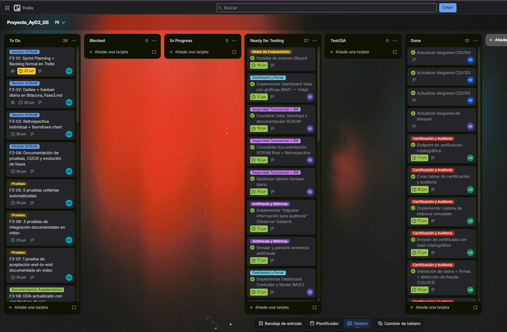
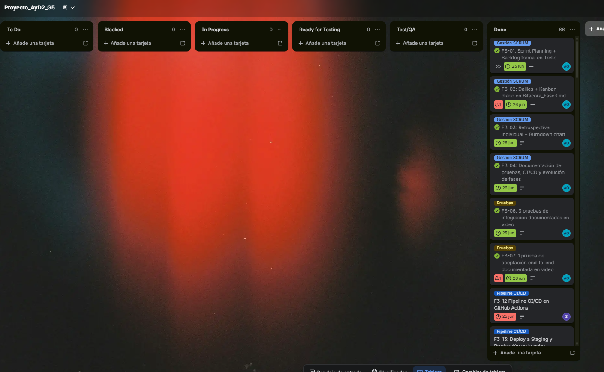
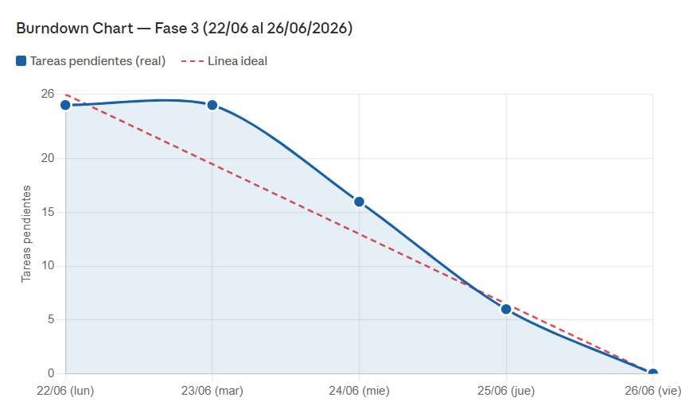

# Bitácora de Trabajo Arquitectónico — Fase 3 (Sprint Final)

**Proyecto:** Plataforma Regional de Certificación de Competencias Digitales (PRCCD)

**Grupo:** 5 — AYD2 Sección P

**Sprint:** Único (lunes 22/06 — viernes 26/06/2026)

**Scrum Master:** Aída Alejandra Mansilla Orantes (202100239)

---

## 1. Sprint Planning y Gestión del Backlog

### 1.1 Objetivo del Sprint

Evolucionar la arquitectura de la PRCCD para soportar nuevos métodos de entrada
(voz en móviles) y notificaciones en tiempo real, desplegando el sistema en una
infraestructura multi-entorno en la nube mediante un pipeline CI/CD automatizado,
sin degradar la estabilidad del MVP construido en la Fase 2.

### 1.2 Sprint Backlog

| ID | Responsable | Tarea | Driver | Estado | Origen |
|----|---|---|---|---|---|
| F3-01 | Alejandra (202100239) | Sprint Planning + Backlog formal en Trello | SCRUM | Done | Funcionalidad nueva F3 |
| F3-02 | Alejandra (202100239) | Dailies + Kanban diario en Bitacora_Scrum_F3.md | SCRUM | Done | Funcionalidad nueva F3 |
| F3-03 | Alejandra (202100239) | Retrospectiva individual + Burndown chart | SCRUM | Done | Funcionalidad nueva F3 |
| F3-04 | Alejandra (202100239) | Docs pruebas + videos + CI/CD + evolución fases 1→2→3 | 4.4 Entregables | Done | Funcionalidad nueva F3 |
| F3-05 | Alejandra (202100239) | 5 pruebas unitarias automatizadas | 4.3 Pruebas | Done | Funcionalidad nueva F3 |
| F3-06 | Alejandra (202100239) | 3 pruebas de integración documentadas en video | 4.3 Pruebas | Done | Funcionalidad nueva F3 |
| F3-07 | Alejandra (202100239) | 1 prueba de aceptación end-to-end documentada en video | 4.3 Pruebas | Done | Funcionalidad nueva F3 |
| F3-08 | Alejandra (202100239) | DDA actualizado con nuevo estilo arquitectónico de voz | 4.4 DDA | Done | Funcionalidad nueva F3 |
| F3-09 | Nufio (201901444) | UI grabación de voz en examen móvil (React) | 4.1 Voz | Done | Funcionalidad nueva F3 |
| F3-10 | Nufio (201901444) | Envío de audio al endpoint STT | 4.1 Voz | Done | Funcionalidad nueva F3 |
| F3-11 | Nufio (201901444) | Mostrar transcripción y continuar flujo adaptativo | 4.1 Voz | Done | Funcionalidad nueva F3 |
| F3-12 | Nufio (201901444) | Pipeline CI/CD en GitHub Actions (Test → Build → Deploy) | 4.4 CI/CD | Done | Funcionalidad nueva F3 |
| F3-13 | Nufio (201901444) | Deploy Staging y Producción en GCP | 4.4 CI/CD | Done | Funcionalidad nueva F3 |
| F3-14 | Kevin (202101007) | Endpoint recepción de audio (multipart/form-data) | 4.1 Voz | Done | Funcionalidad nueva F3 |
| F3-15 | Kevin (202101007) | Integración Speech-to-Text (Whisper local) | 4.1 Voz | Done | Funcionalidad nueva F3 |
| F3-16 | Kevin (202101007) | Retornar texto transcrito al motor adaptativo existente | 4.1 Voz | Done | Funcionalidad nueva F3 |
| F3-17 | Kevin (202101007) | Servicio SMTP transversal (Nodemailer) | 4.2 Notificaciones | Done | Funcionalidad nueva F3 |
| F3-18 | Kevin (202101007) | Email de confirmación a candidato al emitir certificado | 4.2 Notificaciones | Done | Funcionalidad nueva F3 |
| F3-19 | Kevin (202101007) | Reporte consolidado por correo a universidades | 4.2 Notificaciones | Done | Funcionalidad nueva F3 |
| F3-20 | Kevin (202101007) | Alerta a auditores por detección de fraude | 4.2 Notificaciones | Done | Funcionalidad nueva F3 |
| F3-21 | Ludwing (201907608) | Dockerfiles actualizados incluyendo nuevo servicio STT | 4.4 CI/CD | Done | Funcionalidad nueva F3 |
| F3-22 | Ludwing (201907608) | docker-compose para Staging y Producción | 4.4 CI/CD | Done | Funcionalidad nueva F3 |
| F3-23 | Ludwing (201907608) | Trigger email desde módulo de certificación | 4.2 Notificaciones | Done | Funcionalidad nueva F3 |
| F3-24 | Ludwing (201907608) | Trigger alerta desde módulo antifraude | 4.2 Notificaciones | Done | Funcionalidad nueva F3 |
| F3-25 | Ludwing (201907608) | Variables SMTP + STT en .env separado por entorno | 4.4 CI/CD | Done | Funcionalidad nueva F3 |
| F3-26 | Ludwing (201907608) | Integrar módulo de voz al flujo completo de evaluación | 4.1 Voz | Done | Funcionalidad nueva F3 |

### 1.3 Nota sobre Feedback de la Fase 2

No se recibió feedback formal de la Fase 2 por parte del catedrático ni auxiliares
que requiriera correcciones específicas. Por esta razón, la totalidad de las 26 tareas
del Sprint Backlog corresponden a funcionalidades nuevas definidas en el enunciado de
la Fase 3 (secciones 4.1, 4.2, 4.3 y 4.4), y no a correcciones de entregas anteriores.
Esta decisión fue tomada por el equipo en el Sprint Planning del lunes 22/06/2026.

### 1.4 Acuerdos del Sprint Planning (lunes 22/06)

- Rama base de trabajo: `develop`
- Cada tarea se trabaja en su propia rama: `feature/fase3-[modulo]-[carnet]`
- Commits diarios con formato `carnet: mensaje descriptivo`
- Meta del 22/06 (noche): Kevin entrega F3-14, F3-15 y F3-17 para desbloquear a Nufio y Ludwing
- Meta del 23/06 (noche): arranque de implementación con primeras funcionalidades mergeadas
- Meta del 24/06 (noche): todos los módulos individuales completos y mergeados a develop
- Meta del 25/06 (noche): integración total, videos grabados y deploy a la nube funcionando
- Meta del 26/06: retrospectiva y entrega final

### 1.5 Cronograma del Sprint

| Fecha | Actividad |
|---|---|
| 22/06 (lun) | Sprint Planning, captura del kanban inicial, crear ramas feature/ |
| 23/06 (mar) | Daily 1, inicio de desarrollo |
| 24/06 (mie) | Daily 2, completar módulos individuales |
| 25/06 (jue) | Daily 3, integración total y pruebas finales |
| 26/06 (vie) | Cierre, retrospectiva y entrega |

### 1.6 Captura del Tablero Kanban — Inicio del Sprint

---

## 2. Daily Standup (Refinamiento Arquitectónico Diario)

### Martes 23/06/2026 — Daily 1

#### Alejandra Mansilla — Scrum Master + Pruebas

1. **¿Qué componente, servicio, módulo o patrón arquitectónico materializaste o refactorizaste ayer en código, y cuál fue el resultado numérico o funcional?**
   Ejecuté el Sprint Planning de la Fase 3: definí y documenté las 26 tareas del backlog en Trello con etiquetas, descripciones y fechas de entrega, creé la bitácora `Bitacora_Scrum_F3.md`, renombré la de Fase 2 a `Bitacora_Scrum_F2.md` y subí la imagen del kanban inicial. Resultado funcional: 1 commit a develop con la estructura completa de documentación del sprint, 26 tareas registradas en Trello con sus historias de usuario, y repositorio listo para iniciar desarrollo.

2. **¿Qué elemento del diseño técnico, persistencia o flujo transaccional vas a codificar hoy, y cómo asegurarás su trazabilidad directa con los drivers, EaC o restricciones del sistema?**
   Redactaré el capítulo 12 del DDA documentando los nuevos RF26, RF27, RF28 y RF29, la justificación del estilo Pipes and Filters para el STT y la extensión Multi-tier para el servicio de notificaciones. Trazable con la sección 4.1 del enunciado y con EaC01 (desempeño) y EaC03 (disponibilidad) del DDA.

3. **¿Existen impedimentos técnicos, de integración heterogénea o de infraestructura local que pongan en riesgo los EaC o las metas de rendimiento?**
   Las tareas de pruebas (F3-05, F3-06, F3-07) están bloqueadas hasta que Kevin entregue el endpoint STT (F3-14, F3-15) y el servicio SMTP (F3-17). Sin ese código no es posible escribir ni ejecutar las pruebas de los nuevos módulos, lo que pone en riesgo EaC03 (disponibilidad) si los entregables llegan tarde.

---

#### Kevin Santos — STT Backend + Notificaciones

1. **¿Qué componente, servicio, módulo o patrón arquitectónico materializaste o refactorizaste ayer en código, y cuál fue el resultado numérico o funcional?**
   Aplicó correcciones sobre el módulo dev2-integracion de Fase 2: resolvió 3 inconsistencias en el flujo de ingesta de datos académicos y en el proceso de login federado que quedaron pendientes del sprint anterior. Resultado funcional: endpoint `POST /api/auth/login` retornando 200 en los 3 protocolos (LDAP, SAML, OAuth2) y 0 errores en el pipeline de ingestión CSV/JSON/XML.

2. **¿Qué elemento del diseño técnico, persistencia o flujo transaccional vas a codificar hoy, y cómo asegurarás su trazabilidad directa con los drivers, EaC o restricciones del sistema?**
   Implementará el servicio SMTP transversal con Nodemailer (F3-17) y la integración Speech-to-Text con Whisper local (F3-14, F3-15). Trazable con la sección 4.2 de notificaciones y la sección 4.1 de voz del enunciado, y con EaC01 (desempeño) y EaC04 (seguridad en tránsito) del DDA.

3. **¿Existen impedimentos técnicos, de integración heterogénea o de infraestructura local que pongan en riesgo los EaC o las metas de rendimiento?**
   Sin impedimentos.

---

#### Ludwing Lopez — Docker + Infra + Triggers

1. **¿Qué componente, servicio, módulo o patrón arquitectónico materializaste o refactorizaste ayer en código, y cuál fue el resultado numérico o funcional?**
   Realizó optimizaciones a la capa de datos de Fase 2, corrigiendo 2 problemas en la normalización de registros entre módulos. Resultado funcional: 18 tablas del modelo relacional consistentes y sin errores de integridad referencial, confirmadas mediante consultas de verificación directas en MySQL.

2. **¿Qué elemento del diseño técnico, persistencia o flujo transaccional vas a codificar hoy, y cómo asegurarás su trazabilidad directa con los drivers, EaC o restricciones del sistema?**
   Preparará los archivos `docker-compose.staging.yml` y `docker-compose.production.yml` (F3-22), trazable con la sección 4.4 del enunciado y con RT01 y RT02 del DDA que exigen arquitectura preparada para despliegue multi-entorno.

3. **¿Existen impedimentos técnicos, de integración heterogénea o de infraestructura local que pongan en riesgo los EaC o las metas de rendimiento?**
   Sin impedimentos.

---

#### Nufio — Frontend + CI/CD

1. **¿Qué componente, servicio, módulo o patrón arquitectónico materializaste o refactorizaste ayer en código, y cuál fue el resultado numérico o funcional?**
   Evaluó 3 opciones de plataforma de deploy (Railway, Render, GCP) y analizó la documentación de GitHub Actions para definir la estrategia del pipeline CI/CD. Resultado funcional: decisión documentada de usar GCP por soportar más de 5 servicios simultáneos sin límite en el plan gratuito, descartando Railway (límite de 5 servicios) y Render (limitaciones de red entre contenedores).

2. **¿Qué elemento del diseño técnico, persistencia o flujo transaccional vas a codificar hoy, y cómo asegurarás su trazabilidad directa con los drivers, EaC o restricciones del sistema?**
   Iniciará la UI de grabación de voz en el examen móvil (F3-09) y el esqueleto del pipeline CI/CD en GitHub Actions (F3-12), trazables con la sección 4.1 de voz y la sección 4.4 de CI/CD del enunciado, y con EaC01 (desempeño) del DDA.

3. **¿Existen impedimentos técnicos, de integración heterogénea o de infraestructura local que pongan en riesgo los EaC o las metas de rendimiento?**
   Se identificó que Alejandra necesita permisos de administrador en el repositorio para configurar los secrets del pipeline. Pendiente de resolución antes de avanzar en el deploy automatizado, lo que podría retrasar F3-13.

---

### Miércoles 24/06/2026 — Daily 2

#### Alejandra Mansilla — Scrum Master + Pruebas

1. **¿Qué componente, servicio, módulo o patrón arquitectónico materializaste o refactorizaste ayer en código, y cuál fue el resultado numérico o funcional?**
   Actualicé el DDA con el capítulo 12 completo de evolución arquitectónica Fase 3: documenté 4 nuevos RF (RF26–RF29), justifiqué el estilo Pipes and Filters para el STT con su cadena de 6 filtros, y actualicé 7 diagramas (CDU100, CDU101, CDU103, bloques, componentes, distribución y despliegue). Resultado: tarea F3-08 completada, 1 commit a develop con 7 imágenes nuevas en `Docs/Images/`.

2. **¿Qué elemento del diseño técnico, persistencia o flujo transaccional vas a codificar hoy, y cómo asegurarás su trazabilidad directa con los drivers, EaC o restricciones del sistema?**
   Implementaré las 5 pruebas unitarias automatizadas con Jest (F3-05) cubriendo los servicios STT, notificaciones y motor adaptativo. Trazable con la sección 4.3 del enunciado y con EaC04 (seguridad) y EaC05 (integridad) del DDA.

3. **¿Existen impedimentos técnicos, de integración heterogénea o de infraestructura local que pongan en riesgo los EaC o las metas de rendimiento?**
   Las pruebas de integración (F3-06) y la prueba de aceptación (F3-07) están pendientes de que Ludwing termine los triggers de notificación y Nufio complete el mapeo de datos del frontend de voz. Sin esos entregables no es posible ejecutar el flujo end-to-end.

---

#### Kevin Santos — STT Backend + Notificaciones

1. **¿Qué componente, servicio, módulo o patrón arquitectónico materializaste o refactorizaste ayer en código, y cuál fue el resultado numérico o funcional?**
   Implementó el módulo STT dentro de dev1-evaluaciones integrando Whisper local via `whisper.cpp` con conversión de audio a WAV mediante ffmpeg. Resultado funcional: endpoint `POST /api/evaluacion/respuesta-audio` operativo, transcribiendo audio mp3 correctamente y detectando la opción seleccionada por normalización de texto. 1 rama mergeada a develop.

2. **¿Qué elemento del diseño técnico, persistencia o flujo transaccional vas a codificar hoy, y cómo asegurarás su trazabilidad directa con los drivers, EaC o restricciones del sistema?**
   Implementará el servicio de notificaciones completo con Nodemailer (F3-17, F3-18, F3-19, F3-20) cubriendo los 3 flujos de correo: candidato, universidad y auditor. Trazable con RF27, RF28 y RF29 del DDA.

3. **¿Existen impedimentos técnicos, de integración heterogénea o de infraestructura local que pongan en riesgo los EaC o las metas de rendimiento?**
   Sin impedimentos.

---

#### Ludwing Lopez — Docker + Infra + Triggers

1. **¿Qué componente, servicio, módulo o patrón arquitectónico materializaste o refactorizaste ayer en código, y cuál fue el resultado numérico o funcional?**
   Integró Whisper con los drivers del contenedor y levantó los 2 ambientes requeridos (Staging y Producción), completando F3-21 y F3-22. Resultado funcional: 11 contenedores en estado Healthy en staging (MySQL, frontend, 5 servicios backend, notificaciones, antifraude) verificados con `docker compose ps`.

2. **¿Qué elemento del diseño técnico, persistencia o flujo transaccional vas a codificar hoy, y cómo asegurarás su trazabilidad directa con los drivers, EaC o restricciones del sistema?**
   Implementará F3-23 (trigger de email desde el módulo de certificación) y F3-24 (trigger de alerta desde el módulo antifraude), trazables con RF27, RF28 y RF29 del DDA y con EaC03 (disponibilidad).

3. **¿Existen impedimentos técnicos, de integración heterogénea o de infraestructura local que pongan en riesgo los EaC o las metas de rendimiento?**
   Requiere las credenciales SMTP de Mailtrap para integrar los triggers con el servicio de notificaciones. Pendiente de coordinación con Kevin.

---

#### Nufio — Frontend + CI/CD

1. **¿Qué componente, servicio, módulo o patrón arquitectónico materializaste o refactorizaste ayer en código, y cuál fue el resultado numérico o funcional?**
   Integró el módulo STT de Kevin al frontend creando el componente `BotonAudio.jsx` y modificó la vista del examen para que sea responsive en dispositivos móviles. Resultado funcional: F3-09 y F3-10 completados, flujo de grabación de audio funcionando en el portal React con 2 commits a develop.

2. **¿Qué elemento del diseño técnico, persistencia o flujo transaccional vas a codificar hoy, y cómo asegurarás su trazabilidad directa con los drivers, EaC o restricciones del sistema?**
   Configurará el pipeline CI/CD en GitHub Actions con las fases Test → Build → Deploy a GCP (F3-12 y F3-13) y completará el mapeo del texto transcrito al motor adaptativo (F3-11). Trazable con la sección 4.4 del enunciado.

3. **¿Existen impedimentos técnicos, de integración heterogénea o de infraestructura local que pongan en riesgo los EaC o las metas de rendimiento?**
   Tiene pendiente el mapeo del texto transcrito hacia el motor adaptativo para cerrar el flujo de voz end-to-end.

---

### Jueves 25/06/2026 — Daily 3

#### Alejandra Mansilla — Scrum Master + Pruebas

1. **¿Qué componente, servicio, módulo o patrón arquitectónico materializaste o refactorizaste ayer en código, y cuál fue el resultado numérico o funcional?**
   Implementé las 5 pruebas unitarias automatizadas con Jest (F3-05) cubriendo `detectarOpcionDesdeTexto`, `validarArchivoAudio`, `obtenerAuditores`, `quitarBarraFinal` y `notificarCertificadoEmitido` con mocks. Resultado numérico: 14 assertions, 5 describe blocks, 0 fallos, tiempo de ejecución 0.984 segundos. Documentado en `tests/Documentacion_Pruebas.md` con captura de evidencia. 2 commits a develop.

2. **¿Qué elemento del diseño técnico, persistencia o flujo transaccional vas a codificar hoy, y cómo asegurarás su trazabilidad directa con los drivers, EaC o restricciones del sistema?**
   Implementaré las 4 pruebas de integración automatizadas con Supertest (F3-06) cubriendo el flujo STT completo, la emisión de certificado con PKI y las notificaciones por Mailtrap. Trazable con RF26, RF27, RF28 y RF29 del DDA, y con EaC04 (seguridad) y EaC05 (integridad).

3. **¿Existen impedimentos técnicos, de integración heterogénea o de infraestructura local que pongan en riesgo los EaC o las metas de rendimiento?**
   La construcción del contenedor dev1-evaluaciones tardó varias horas por la velocidad de conexión de la máquina virtual, poniendo en riesgo EaC03. Se resolvió cargando la imagen pre-compilada de Whisper compartida por Ludwing mediante `docker load`.

---

#### Kevin Santos — STT Backend + Notificaciones

1. **¿Qué componente, servicio, módulo o patrón arquitectónico materializaste o refactorizaste ayer en código, y cuál fue el resultado numérico o funcional?**
   Completó las tareas F3-19 (reporte consolidado a universidades), F3-20 (alerta automática a auditores) y F3-16 (retorno del texto transcrito al motor adaptativo). Resultado funcional: 3 flujos de correo operativos verificados en Mailtrap, 2 endpoints nuevos en el `servicio-notificaciones` (puerto 4006), todas las ramas mergeadas a develop sin conflictos.

2. **¿Qué elemento del diseño técnico, persistencia o flujo transaccional vas a codificar hoy, y cómo asegurarás su trazabilidad directa con los drivers, EaC o restricciones del sistema?**
   Realizará pruebas de regresión sobre los módulos implementados y búsqueda de bugs, trazable con EaC03 (disponibilidad) y EaC05 (integridad) del DDA para garantizar que ningún flujo existente fue afectado por los cambios de Fase 3.

3. **¿Existen impedimentos técnicos, de integración heterogénea o de infraestructura local que pongan en riesgo los EaC o las metas de rendimiento?**
   Durante el merge surgió 1 conflicto en un archivo de rutas que fue resuelto exitosamente sin pérdida de funcionalidad.

---

#### Ludwing Lopez — Docker + Infra + Triggers

1. **¿Qué componente, servicio, módulo o patrón arquitectónico materializaste o refactorizaste ayer en código, y cuál fue el resultado numérico o funcional?**
   Completó F3-23 (trigger de email desde certificación), F3-24 (trigger de alerta desde antifraude), F3-25 (variables SMTP y STT en archivos `.env` separados por entorno) y F3-26 (integración del módulo de voz al flujo completo). Resultado funcional: 4 tareas completadas y mergeadas, infraestructura multi-entorno documentada en `ComoUsar.md` con comandos verificados para staging y producción.

2. **¿Qué elemento del diseño técnico, persistencia o flujo transaccional vas a codificar hoy, y cómo asegurarás su trazabilidad directa con los drivers, EaC o restricciones del sistema?**
   Realizará pruebas de los módulos implementados y búsqueda de bugs, trazable con EaC03 (disponibilidad) y EaC02 (escalabilidad) del DDA.

3. **¿Existen impedimentos técnicos, de integración heterogénea o de infraestructura local que pongan en riesgo los EaC o las metas de rendimiento?**
   Hubo confusiones con código desordenado en algunos módulos que fueron resueltas sin afectar la funcionalidad final.

---

#### Nufio — Frontend + CI/CD

1. **¿Qué componente, servicio, módulo o patrón arquitectónico materializaste o refactorizaste ayer en código, y cuál fue el resultado numérico o funcional?**
   Completó F3-11 (mapeo del texto transcrito al motor adaptativo) cerrando el flujo de voz end-to-end, e inició el pipeline CI/CD en GitHub Actions. Resultado funcional: flujo de voz completamente funcional en el portal React con 3 componentes integrados (BotonAudio.jsx, hookExamen.jsx, ComponentesExamen.jsx), y primer workflow de GitHub Actions creado con las fases Test, Build y Deploy.

2. **¿Qué elemento del diseño técnico, persistencia o flujo transaccional vas a codificar hoy, y cómo asegurarás su trazabilidad directa con los drivers, EaC o restricciones del sistema?**
   Completará la configuración del pipeline CI/CD con deploy automatizado a GCP (F3-12, F3-13), trazable con la sección 4.4 del enunciado y con EaC03 (disponibilidad) del DDA.

3. **¿Existen impedimentos técnicos, de integración heterogénea o de infraestructura local que pongan en riesgo los EaC o las metas de rendimiento?**
   Se descartó AWS y Railway por limitaciones de servicios. Se migró a GCP como plataforma de deploy, generando tiempo adicional de configuración no planificado que pone en riesgo el cumplimiento de la meta del 25/06.

---

## 3. Sprint Retrospective e Impacto Estructural

### Alejandra Mansilla — Scrum Master + Pruebas

- **¿Qué decisiones de diseño y patrones arquitectónicos se consolidaron con éxito al interactuar con el código fuente real?**
  La decisión de usar Pipes and Filters para el procesamiento STT se consolidó correctamente al revisar el código. Cada filtro opera de forma independiente y el resultado de uno alimenta al siguiente sin acoplamiento. Las 14 assertions de las pruebas unitarias confirmaron que cada función puede probarse de forma aislada sin levantar infraestructura, lo que valida que el diseño es correcto arquitectónicamente.

- **¿Qué supuestos teóricos o diagramas de la Fase 1 demostraron fallas evidentes, provocaron cuellos de botella o requirieron una refactorización de emergencia durante la implementación?**
  El diagrama de despliegue de la Fase 1 usaba tecnologías planificadas que nunca se implementaron (Spring Boot, Apache Camel, Kafka, Hyperledger). Fue necesario reemplazarlo completamente por uno que refleja lo realmente implementado. Esto evidencia que los diagramas de Fase 1 eran aspiracionales y no descriptivos, generando deuda de documentación que se saldó en este sprint.

- **¿Qué mejoras técnicas concretas se proponen para asegurar la mantenibilidad futura del ecosistema?**
  Agregar un archivo README por servicio que documente sus endpoints, variables de entorno y dependencias. También se propone mantener actualizado el diagrama de despliegue al final de cada fase para evitar acumulación de deuda documental.

---

### Kevin Santos — STT Backend + Notificaciones

- **¿Qué decisiones de diseño y patrones arquitectónicos se consolidaron con éxito al interactuar con el código fuente real?**
  La decisión de usar Whisper local en lugar de una API externa se consolidó como correcta. Al no depender de una clave de API externa, el sistema puede correr completamente on-premise sin costos adicionales. La variable de entorno `STT_PROVIDER` permite cambiar de proveedor sin modificar el código, demostrando que el diseño es flexible y extensible.

- **¿Qué supuestos teóricos o diagramas de la Fase 1 demostraron fallas evidentes, provocaron cuellos de botella o requirieron una refactorización de emergencia durante la implementación?**
  El supuesto de que las notificaciones podían implementarse como un módulo simple subestimó la complejidad de manejar credenciales SMTP por entorno. La separación entre `smtp.env.example` y `smtp.env` requirió coordinación adicional con el equipo para que cada integrante configurara sus propias credenciales sin subir información sensible al repositorio.

- **¿Qué mejoras técnicas concretas se proponen para asegurar la mantenibilidad futura del ecosistema?**
  Implementar una cola de mensajes para las notificaciones de modo que un fallo del SMTP no bloquee el flujo principal de certificación. Una cola persistente garantizaría que ninguna notificación se pierda incluso si el proveedor SMTP está temporalmente no disponible.

---

### Ludwing Lopez — Docker + Infra + Triggers

- **¿Qué decisiones de diseño y patrones arquitectónicos se consolidaron con éxito al interactuar con el código fuente real?**
  La separación de entornos en archivos docker-compose independientes demostró ser la decisión correcta. Permitió que cada integrante pudiera levantar el sistema en staging sin afectar el entorno de producción. Los triggers de notificación desde certificación y antifraude funcionaron correctamente como extensiones del sistema existente sin modificar la lógica core.

- **¿Qué supuestos teóricos o diagramas de la Fase 1 demostraron fallas evidentes, provocaron cuellos de botella o requirieron una refactorización de emergencia durante la implementación?**
  El supuesto de que el contenedor de dev1-evaluaciones tendría un tiempo de construcción similar al resto resultó incorrecto. La compilación de Whisper desde cero tarda entre 45 y 90 minutos dependiendo de la conexión, lo que impactó el tiempo de onboarding de nuevos miembros. Se resolvió exportando la imagen pre-compilada para compartirla entre el equipo.

- **¿Qué mejoras técnicas concretas se proponen para asegurar la mantenibilidad futura del ecosistema?**
  Publicar la imagen de dev1-evaluaciones en GitHub Container Registry para que cualquier integrante pueda descargarla directamente sin compilar Whisper desde cero, reduciendo el tiempo de setup de horas a minutos.

---

### Nufio — Frontend + CI/CD

- **¿Qué decisiones de diseño y patrones arquitectónicos se consolidaron con éxito al interactuar con el código fuente real?**
  La decisión de separar el componente de grabación de voz en `BotonAudio.jsx` independiente del componente principal del examen se consolidó como correcta. Al tenerlo desacoplado, fue posible integrarlo sin modificar la lógica adaptativa existente, cumpliendo con el principio de extensión sin modificación que guía la arquitectura de Fase 3.

- **¿Qué supuestos teóricos o diagramas de la Fase 1 demostraron fallas evidentes, provocaron cuellos de botella o requirieron una refactorización de emergencia durante la implementación?**
  La plataforma de deploy inicialmente planificada como Railway resultó insuficiente para el número de servicios del proyecto (límite de 5 servicios en el plan gratuito). Fue necesario migrar a GCP durante el sprint, generando tiempo adicional de configuración no planificado. AWS también fue descartado por complejidad de configuración en el tiempo disponible.

- **¿Qué mejoras técnicas concretas se proponen para asegurar la mantenibilidad futura del ecosistema?**
  Definir la plataforma de deploy desde la Fase 1 y no dejarlo para la última fase. La decisión tardía generó retrabajo y presión innecesaria. Para proyectos futuros se recomienda validar los límites del plan gratuito de cada plataforma antes de comprometerse con ella en el diseño.

---

## 4. Cierre del Sprint

### 4.1 Captura del Tablero Kanban — Cierre del Sprint

### 4.2 Burndown Chart

| Día | Tareas completadas ese día | Tareas pendientes acumuladas |
|---|---|---|
| Lunes 22/06 | 1 (F3-01 Sprint Planning) | 25 |
| Martes 23/06 | 0 (inicio de desarrollo, sin merges) | 25 |
| Miércoles 24/06 | 9 (F3-08, F3-05, F3-09, F3-10, F3-14, F3-15, F3-16, F3-21, F3-22) | 16 |
| Jueves 25/06 | 10 (F3-06, F3-11, F3-17, F3-18, F3-19, F3-20, F3-23, F3-24, F3-25, F3-26) | 6 |
| Viernes 26/06 | 6 (F3-02, F3-03, F3-04, F3-07, F3-12, F3-13) | 0 |

### 4.3 Grabaciones de Reuniones

[Grabaciones del Sprint — Google Drive](https://drive.google.com/drive/folders/1-SWEBBs9clUGlC0Eym9vq7eZlRAcfWYR?usp=sharing)

---

## 5. Aplicación de Feedback de la Fase 2

No se recibió feedback formal de la Fase 2 por parte del catedrático ni auxiliares
que requiriera correcciones específicas. La totalidad de las 26 tareas del Sprint
Backlog corresponde a funcionalidades nuevas definidas en el enunciado de la Fase 3.
Esta situación fue registrada en el Sprint Planning del lunes 22/06/2026 y es
consistente con lo documentado en la sección 1.3 de esta bitácora.